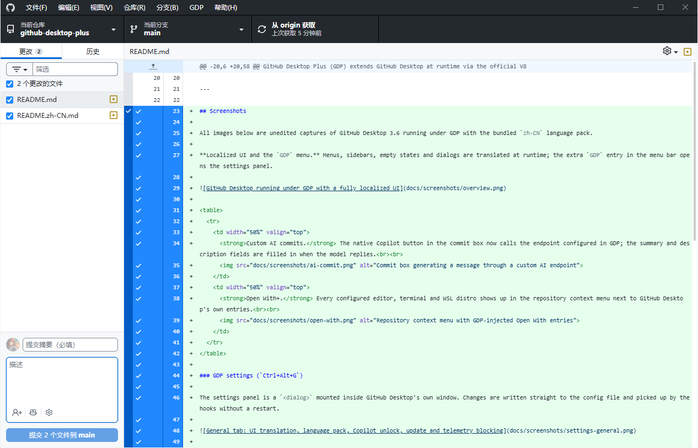
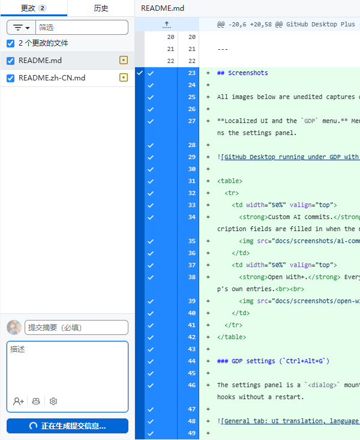
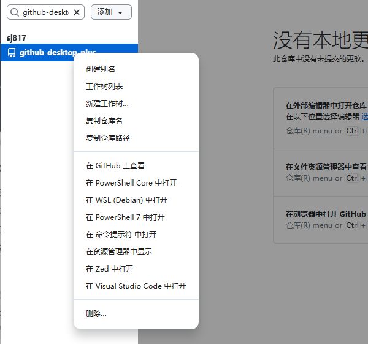
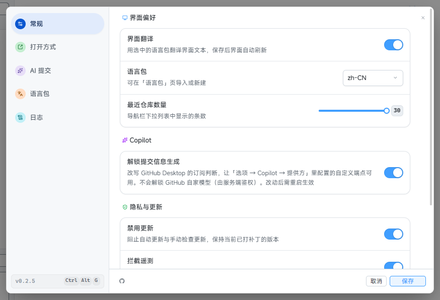
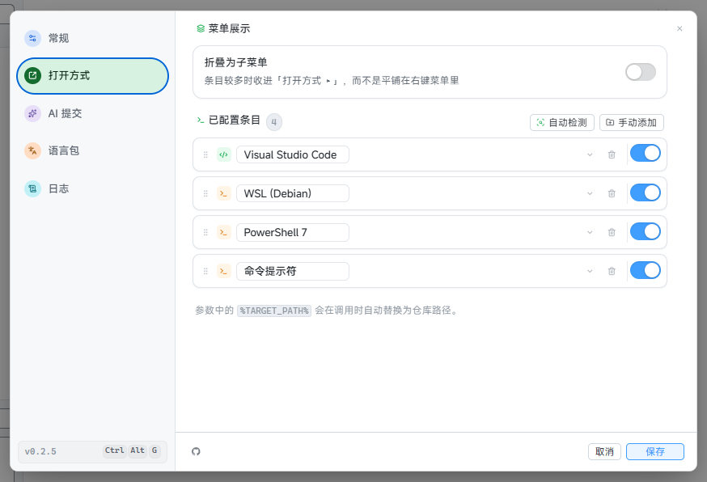
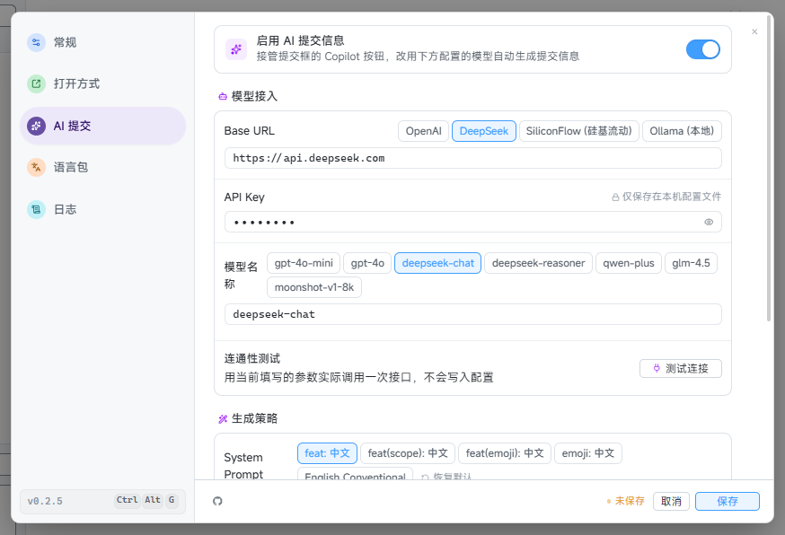
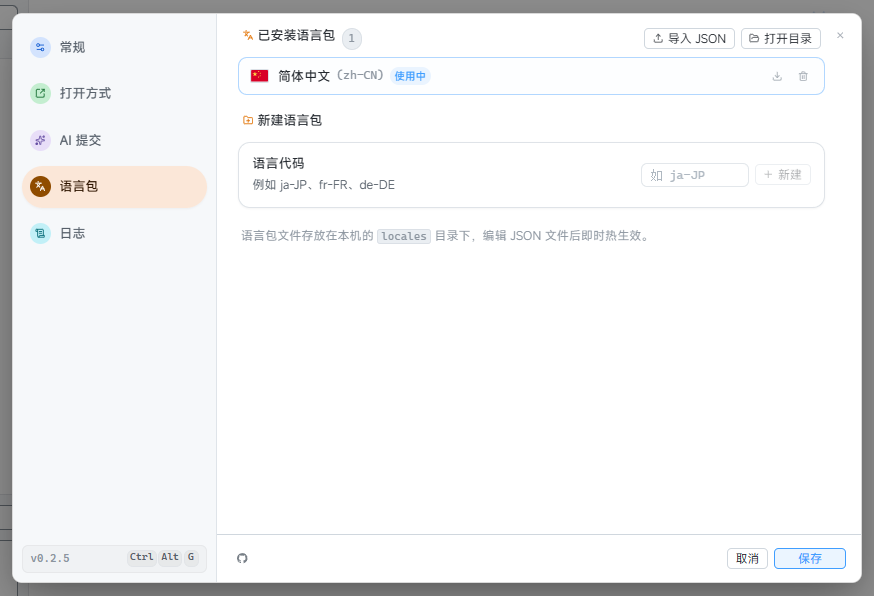
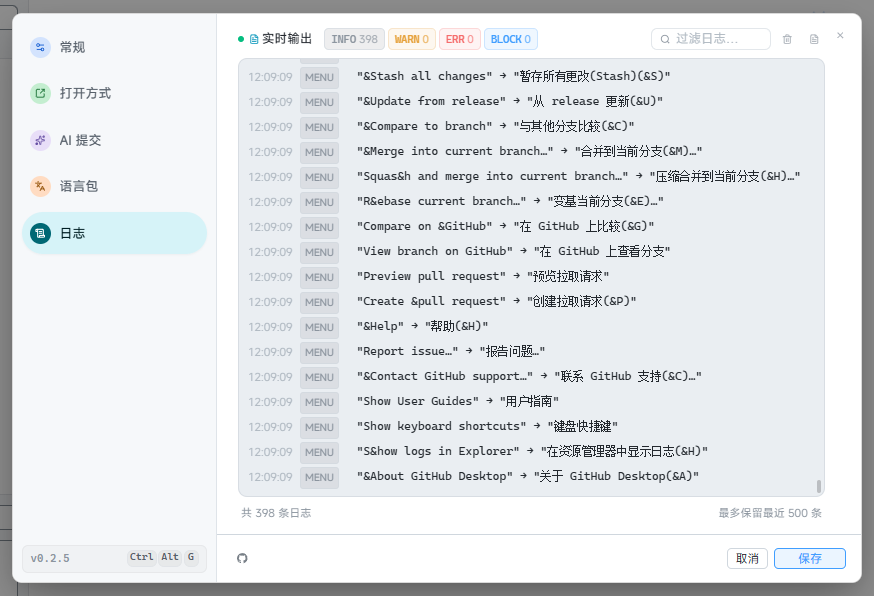

# GitHub Desktop Plus

GitHub Desktop 的外部扩展与 Hook 增强工具套件。

GitHub Desktop Plus (GDP) 在启动时通过官方 V8 Inspector 调试协议（`--inspect-brk=0`）动态注入 GitHub Desktop，在**不修改任何官方安装文件、不破坏数字签名、不引入持久性修改**的前提下，为 GitHub Desktop 带来进阶增强功能：自定义大模型 AI 提交信息、右键多编辑器与多终端并发启动、完整中文汉化、WSL 2 跨环境集成以及隐私遥测/自动更新拦截。

[English](README.md) · [简体中文](README.zh-CN.md)

---

## 增强功能

- **自定义 AI 提交信息**：接管提交框中原生的 Copilot 星火按钮。支持连接任意兼容 OpenAI 协议的模型（OpenAI、DeepSeek、Ollama、硅基流动等），支持自定义 System Prompt 与实时往返延迟测试。
- **多编辑器与多终端（打开方式增强）**：为仓库右键菜单提供无限制的外部程序启动支持。自动探测 VS Code、Cursor、Zed、JetBrains 全家桶、Windows Terminal、PowerShell、WSL 发行版等，支持 60fps 物理拖拽排序与子菜单折叠。
- **完整界面汉化 (i18n)**：全量汉化菜单、右键菜单、操作按钮与对话框文本，带矢量国旗预览。支持本地 JSON 语言包热重载、导入与导出。
- **WSL 2 跨环境集成**：直接在 Windows 宿主版中管理 WSL 仓库，提供透明的 `/mnt/c/` ↔ `\\wsl$\` 路径转换。
- **隐私与版本锁定**：彻底拦截发往 GitHub 的后台遥测数据；支持一键禁用自动更新，避免环境被静默覆盖。
- **内嵌扁平设置面板**：按下 `Ctrl+Alt+G` 或点击菜单栏 `GDP` 唤起纯扁平设计的设置弹窗（React 19），所有配置即时热生效无需重启。
- **零篡改安全性**：仅在运行时通过标准调试接口注入 Hook，您的官方 GitHub Desktop 安装文件保持 100% 纯净完好。
- **超轻量 Rust 核心**：原生 Rust 启动器，常驻内存增量 < 10MB。

---

## 界面截图

以下均为 GDP 托管的 GitHub Desktop 3.6 实机截图，未经修图，语言包为内置的 `zh-CN`。

**汉化界面与 `GDP` 菜单。** 菜单栏、侧边栏、空状态与对话框在运行时完成翻译；菜单栏额外多出的 `GDP` 项用于打开设置面板。



<table>
  <tr>
    <td width="50%" valign="top">
      <strong>自定义 AI 提交信息。</strong> 提交框里原生的 Copilot 按钮改为调用 GDP 中配置的端点，模型返回后自动填入摘要与描述。<br><br>
      
    </td>
    <td width="50%" valign="top">
      <strong>打开方式增强。</strong> 配置过的编辑器、终端与 WSL 发行版会出现在仓库右键菜单中，与 GitHub Desktop 原生条目并列。<br><br>
      
    </td>
  </tr>
</table>

### GDP 设置面板（`Ctrl+Alt+G`）

设置面板是挂载在 GitHub Desktop 自身窗口内的 `<dialog>`，修改直接写入配置文件，Hook 侧无需重启即可读到。



<table>
  <tr>
    <td width="50%" valign="top">
      <strong>打开方式。</strong> 自动探测与手动添加的启动项，支持拖拽排序；参数中的 <code>%TARGET_PATH%</code> 会在调用时替换为仓库路径。<br><br>
      
    </td>
    <td width="50%" valign="top">
      <strong>AI 提交。</strong> Base URL 预设、模型名称、就地连通性测试，以及可切换的 System Prompt 风格。<br><br>
      
    </td>
  </tr>
  <tr>
    <td width="50%" valign="top">
      <strong>语言包。</strong> 已安装语言包、JSON 导入与新语言脚手架；编辑 JSON 文件后即时热生效。<br><br>
      
    </td>
    <td width="50%" valign="top">
      <strong>日志。</strong> Hook 的实时输出（i18n、菜单、更新与遥测决策），带级别筛选与搜索。<br><br>
      
    </td>
  </tr>
</table>

---

## 运行原理

GDP 作为一个轻量级启动引导器，使用 `--inspect-brk=0` 参数唤起 GitHub Desktop，通过 Chrome DevTools Protocol (CDP) 建立连接，并在主进程和渲染进程脚本执行前注入 Hook：

```text
┌───────────────────────────┐         ┌──────────────────────────────┐
│  gdp (Rust 启动器)        │   CDP   │  GitHub Desktop (Electron)   │
│  • 内嵌 Hook Bundles      │────────→│  • 主进程 Hook               │
│  • 内嵌设置面板 UI        │         │    - 拦截遥测与自动更新      │
│  • 内嵌语言包             │         │    - AI 请求转发与 IPC 调度  │
│                           │         │  • 渲染进程 Hook             │
│                           │         │    - DOM / 菜单 i18n 热汉化  │
│                           │         │    - 接管 Copilot 生成按钮   │
│                           │         │    - 内嵌设置弹窗 (<dialog>) │
└───────────────────────────┘         └──────────────────────────────┘
```

所有通信（配置读写、日志流、AI 生成、语言包）直接在进程内通过强类型 Electron IPC 传输，无需开启本地 HTTP 端口。

---

## 安装与使用

在 WSL 中执行一条命令即可安装（需要 Windows x64、GitHub Desktop、WSL 2，并开启 Windows 互操作）：

```bash
curl -fsSL https://github.com/sj817/github-desktop-plus/releases/latest/download/install.sh | bash
```

安装脚本会从 GitHub Releases 下载最新的 MSI、校验 SHA-256，然后按当前用户安装到 `%LOCALAPPDATA%\GitHubDesktopPlus`，并创建 WSL 命令 `~/.local/bin/gdp`。运行 `gdp` 启动增强版 GitHub Desktop；进入界面后按 `Ctrl+Alt+G` 或点击顶部菜单 `GDP` 打开设置面板。

如需手动安装，请从 [Releases](https://github.com/sj817/github-desktop-plus/releases) 下载 `GitHubDesktopPlus-win-x64-Setup.exe` 和对应的 `.sha256` 文件。社区 Inno Setup 标准向导会在写入文件前显示可修改的安装位置，并跟随 Windows 明暗主题；只有你在完成页主动选择后才会运行应用。内嵌 MSI 负责事务式安装与回滚，独立 `.msi` 继续用于 WSL 和受管部署。安装完成后会创建稳定的桌面和开始菜单快捷方式；运行资源和配置统一放在用户级 `%APPDATA%\github-desktop-plus`，不写到版本化程序目录旁。

---

## 本地开发与构建

### 前置要求
- Node.js >= 22.18, pnpm 9.15.9
- Rust toolchain (stable)

### 常用命令

```bash
# 安装依赖
pnpm install

# 进入开发模式（Vite HMR + Hook 热编译 + GDP + GitHub Desktop）
pnpm dev

# 在浏览器中独立调试设置界面（带 Mock 桥）
pnpm --filter @github-desktop-plus/settings-ui dev

# 类型检查
pnpm run typecheck

# 全量打包构建
pnpm run build

# 构建 Inno Setup 安装向导、MSI 与便携包
pnpm run package:windows
```

---

## 免责声明

GitHub Desktop Plus 是一个独立的开源项目，与 GitHub, Inc. 或 Microsoft Corporation 无任何隶属、背书或关联关系。GitHub 与 GitHub Desktop 是 GitHub, Inc. 的注册商标。

GitHub Desktop 官方源码遵循 [MIT 许可证](https://github.com/desktop/desktop/blob/development/LICENSE)。

---

## 开源许可证

[MIT](LICENSE)
